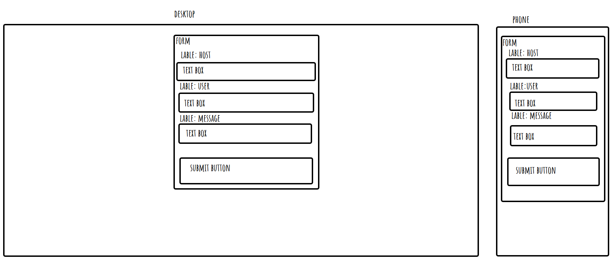

# week 3 assingment

## Reflection

- basic requirements

  - form is submitting data into the database as expected done ease
  - dynamic CSS styling done ease but im no artes
  - Create a GET API route in server done ease
  - Create a POST API route in client done ease
  - database dummy data done ease

- stretch goals

  - form validation done ease
  - Added delete button done not ease
  - Create like button done not ease

## References

- delete and like button adding them was ease but the code to work with the sql was evil (PUT and DELETE) for express i did not know about untill a asks for help
- i use a lot of googleing to make this one to work
- i use okso.app to help make a layout

https://guestbook-client-q1nt.onrender.com

https://guestbook-server-4ymb.onrender.com

https://github.com/lukeplechaty/04-week-assignment
